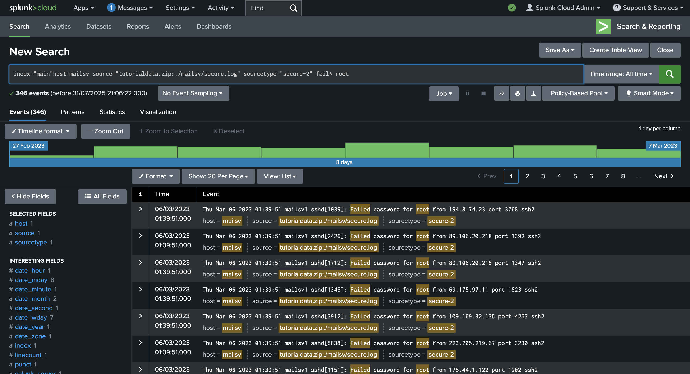

# Splunk Log Analysis: Failed Login Detection

This project demonstrates how to use **Splunk** to detect and analyze failed login attempts on Linux systems using SSH. The data is taken from simulated `.secure.log` files and processed via SPL queries.

## Use Case

- Detect brute-force attacks
- Audit authentication failures
- Analyze login attempts over time

## Screenshot



## SPL Query Used

```spl
index="main" host=mailsv source="tutorialdata.zip:./mailsv/secure.log" sourcetype="secure-2" fail* root
